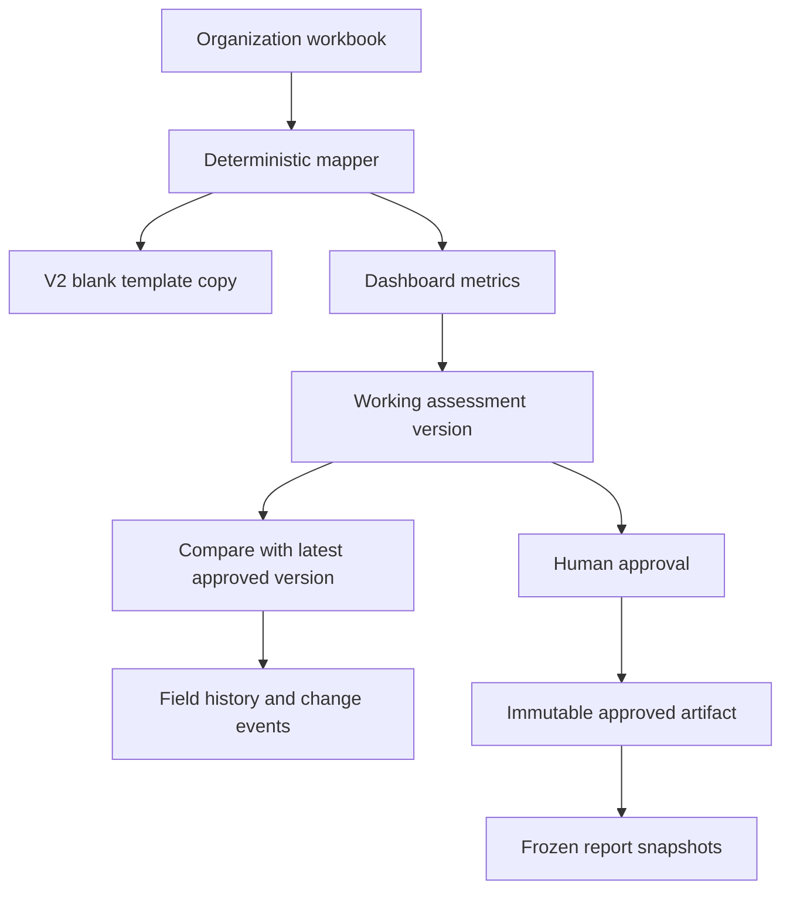

# Architecture

## Assessment flow

`SmartMappingEngine` supports two deterministic intake paths:

1. A canonical V2 path copies same-named input tables by normalized header into the supplied V2 blank template while preserving target formulas.
2. The existing wide-model fallback detects fiscal-year columns, financial line items, repeated property statements, unit evidence and debt patterns. Flat-table fallback mapping requires exact normalized header matches.

There is no AI service or AI fallback.

## Version and workflow state

Each organization has a durable `OrganizationPortfolioState` document. It holds:

- assessment versions;
- field history and material change events;
- actions and decisions;
- governance/reporting obligations;
- source documents and metric evidence;
- future events; and
- report snapshots.

A new upload creates a **Working** assessment and compares it with the latest **Approved** assessment, or the current version when no approved baseline exists. Approval records reviewer/date metadata, verifies the linked evidence, synchronizes workflow tables into the generated workbook, and then treats that workbook as immutable.

Actions and obligations remain organization-level workflow records after an assessment is approved. Later workflow mutations do not rewrite an approved assessment artifact.

## Deterministic materiality

Thresholds are configured under `Irei:Materiality`:

- absolute DSCR movement;
- capital-needs amount;
- capital-needs percentage; and
- forward debt-maturity horizon.

Any property add/remove, risk-class change, classification change, unit conflict, overall-status change, or mission-unit classification change is reviewable. Every change is recorded; only threshold-triggering changes are marked material and auto-linked to an action.

## Workbook behavior

The generated workbook is copied from `IREI_MVP_Stage1_V2_Blank_Template.xlsx`. Direct input values are patched into canonical tables. Existing formula cells are never overwritten. Calculation mode is set to automatic, the calculation chain is removed, and a full recalculation is requested when Excel or LibreOffice opens the file.

Server dashboard metrics do not depend on cached workbook formulas. Formula-backed flags such as unit conflicts and debt-service totals have deterministic application-side fallbacks.

## Reports and authorized use

A report record always references an assessment `Version_ID`. Creation freezes an `.xlsx` artifact. Report approval requires an approved assessment version. Sharing requires an approved report and records the authorized user and timestamp. Prior reports remain retained and a new report can reference the report it supersedes.

## API and privacy boundary

Participant APIs return `AssessmentView`, `SourceDocumentView`, and `ReportSnapshotView`. These models omit input paths, output paths, evidence storage paths and report artifact paths. Generated assessment workbooks and approved-report downloads remain behind the configured authorization key; report artifacts are also addressed by opaque report IDs.

The current file-backed implementation is suitable for the Stage 1 MVP. Production should add authenticated users, role-based authorization, encryption, managed object storage, transactional persistence, audit logging and retention controls.
